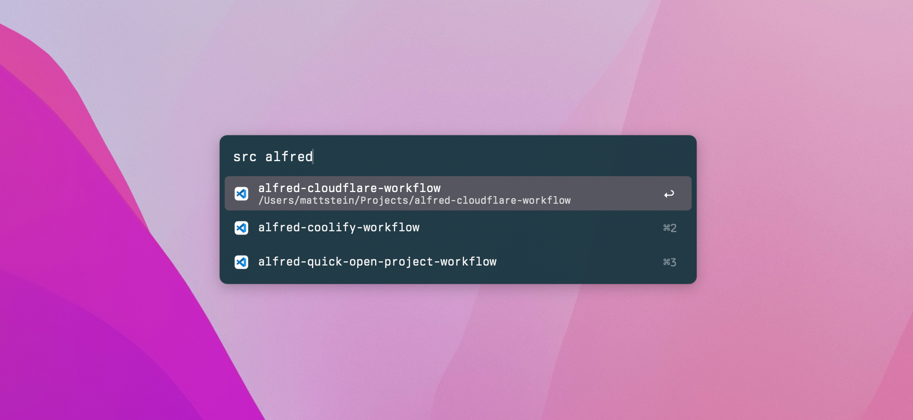

# Quick Open Project Alfred Workflow

This Alfred workflow fuzzy-searches your development directories so you can quickly open projects in VS Code, PhpStorm, iTerm, or Finder.

It’s heavily tailored to how I use it, but you can change the editors quickly and even dig into `search.php` if you’d like to adjust the configuration of the underlying [Fuze](https://github.com/Loilo/Fuse) library.

Screenshot using the dark variant of my [custom theme](https://github.com/mattstein/alfred-theme).

## Installation

Download the `.alfredworkflow` file from the [latest release](https://github.com/mattstein/alfred-quick-open-project-workflow/releases) and double-click to install.

## Configuration

You need to configure an environment variable with your project folder paths, which should be a comma-separated list of directories that contain your project folders.

You can add however many you’d like, and it’ll work fine if you use Alfred on different machines and add paths relevant to each one.

Set this from the **Workflows** settings, clicking **Quick Open Project**, then the **[x]** at the top right, and clicking the **Environment Variables** tab.

| Variable            | Default | Required? | Note |
|---------------------| --- | --- | --- |
| `SEARCH_PATHS`      |  | ✅ | Example: `~/dev,~/Documents/Projects` |

## Usage

Use the `src` keyword to fuzzy search your directories.

- <kbd>return</kbd> opens the selection in VS Code
- <kbd>⌘</kbd> + <kbd>return</kbd> opens the selection in PhpStorm
- <kbd>shift</kbd> + <kbd>return</kbd> opens the selection in iTerm
- <kbd>ctrl</kbd> + <kbd>return</kbd> reveals the selection in Finder
